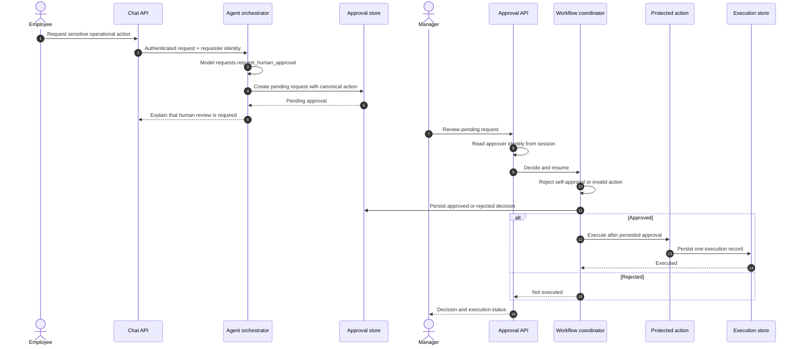
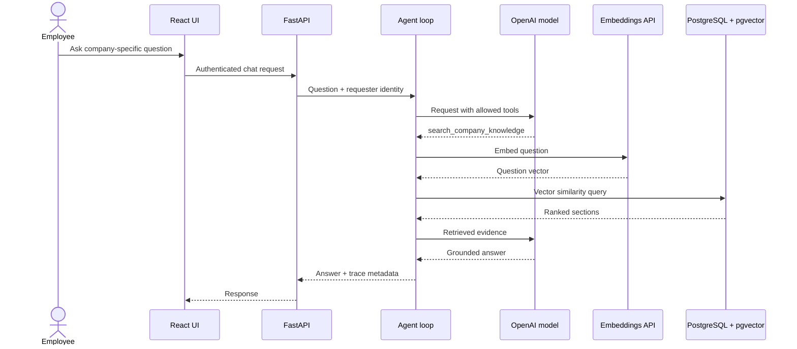

# Architecture

This document describes the public demo's implementation boundaries. It is
more technical than the [README](README.md), but intentionally stays focused
on the decisions that make the system safe to inspect and extend.

## System Overview

```mermaid
flowchart TB
    browser["React client<br/>login, chat, approvals"] --> http["HTTP / session API"]
    http --> fastapi["FastAPI application"]

    fastapi --> auth["Session authentication<br/>employee / approver RBAC"]
    fastapi --> orchestrator["Agent orchestration"]
    fastapi --> approval_api["Approval API"]

    orchestrator --> model["OpenAI Responses API"]
    model --> tool_loop["Manual tool-calling loop"]
    tool_loop --> retrieval["Semantic retrieval"]
    tool_loop --> operations["Deterministic operations"]
    tool_loop --> approval_request["Approval request creation"]

    retrieval --> embeddings["OpenAI embeddings"]
    embeddings --> pgvector["PostgreSQL + pgvector"]

    approval_api --> coordinator["Approval workflow coordinator"]
    coordinator --> protected["Protected Python action"]
    coordinator --> execution_store["Execution store"]
    approval_request --> approval_store["Approval store"]

    fastapi --> traces["Observability / trace writer"]
    orchestrator --> traces
    coordinator --> traces
```



## Layers

### 1. React client

The frontend provides login, chat, approval review, and workflow status
surfaces. It communicates with the FastAPI service and does not own
authorization decisions.

### 2. FastAPI API

`api.py` exposes health, authentication, chat, and approval endpoints. It
serves the production React build when available and applies session,
security-header, and CORS configuration.

### 3. Authentication and RBAC

The demo uses signed sessions and two roles:

- employees can ask questions and create approval requests;
- approvers can decide another employee's pending request.

The requester and approver identities are taken from the server session. They
are not accepted as trusted values from the browser or model output. This is a
portfolio-stage authentication boundary, not enterprise IAM.

### 4. Agent orchestration

`agent.py` owns the model-facing tool definitions and the manual loop around
the OpenAI Responses API. The loop:

1. sends the user request and allowed tools to the model;
2. identifies requested function calls;
3. parses and validates arguments;
4. executes the corresponding Python function;
5. records tool timing and results;
6. sends tool results back to the model when appropriate;
7. persists a completed trace.

The model can request a tool, but it does not execute Python or access the
database directly.

### 5. Retrieval

`semantic_search.py` embeds the question, queries the knowledge table by
vector distance, and returns the highest-ranked sections. The ingestion path
extracts source documents, preserves section context, chunks content, and
stores embeddings.

The public repository contains only fictional sample knowledge. Private local
documents and runtime records are excluded by repository and Docker ignore
rules.

### 6. PostgreSQL + pgvector

PostgreSQL stores the knowledge chunks and their vector embeddings. Using the
existing relational database avoids introducing a second data service for the
demo. The local Docker setup uses an official pgvector PostgreSQL image and a
named volume.

Database setup is explicit. Container startup does not silently run ingestion
or make AI calls.

### 7. Deterministic operational tools

The agent can call:

- `search_company_knowledge`;
- `calculate_delivery_timeline`;
- `request_human_approval`.

The delivery calculator handles date arithmetic in Python. Approval creation
uses a canonical approval type controlled by Python. The model does not choose
the workflow's internal action identifier.

### 8. Approval workflow coordinator

`approval_workflow.py` separates decision from execution:

1. load the persisted request;
2. prevent requester self-approval;
3. validate the approval type and expected action;
4. persist the human decision;
5. resume execution only for an approved request;
6. report an honest failed execution state if the protected action fails.

Approval and execution are separate persisted states.

### 9. Protected execution layer

`protected_actions.py` is the final gate for the simulated rush-production
action. It checks:

- supported approval type;
- persisted approval status is `approved`;
- a matching execution does not already exist.

It then writes a local execution record. The action is intentionally simulated
and does not contact a real business system.

### 10. Observability

`observability.py` records:

- trace identifiers and timestamps;
- model, embedding, and tool durations;
- token usage;
- estimated model cost;
- estimated embedding cost;
- aggregate estimated API cost;
- status and error type.

Trace data is runtime-local and is not published as sample output.

### 11. Tests

The project test runner covers:

- approval and execution invariants;
- requester/approver identity separation;
- tool contracts;
- API behavior and authentication;
- production configuration;
- observability calculations;
- public-repository safety;
- regression-threshold contracts.

The test suite is deliberately runnable without OpenAI or an external
database. Live model evaluation is a separate, deliberate operation.

### 12. Docker and CI

The Dockerfile uses a Node frontend build stage and a slim Python runtime
stage. The final image runs as a non-root user and receives secrets only at
runtime.

GitHub Actions uses Python 3.12 and Node 22 to run the offline test runner and
frontend build. It does not start PostgreSQL, run Docker-in-Docker, or call
OpenAI.

## Human Approval Sequence



The LLM cannot approve or execute. The manager's authenticated session and the
backend workflow are the authorities.

## Retrieval and Answering Sequence



## Project Structure

```text
agent.py
api.py
semantic_search.py
approval_workflow.py
protected_actions.py
observability.py
frontend/
evaluations/
tests/
examples/
Dockerfile
docker-compose.yml
```

## Trust Boundaries

| Boundary | Authority |
| --- | --- |
| User identity | Server-side authenticated session |
| Company facts | Retrieved knowledge evidence |
| Date calculations | Deterministic Python tool |
| Approval type | Python canonicalization |
| Approval decision | Authenticated approver through Approval API |
| Execution eligibility | Persisted approval record and workflow validation |
| Execution duplication | Execution store check |
| Runtime secrets | Environment or secrets manager |
| Public sample data | Fictional Northstar Atelier files |

The central design principle is that model output is an input to validation,
not a replacement for validation.