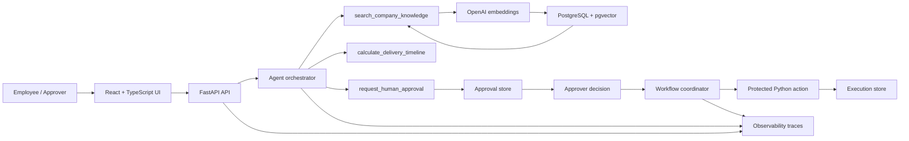

# AI Knowledge & Operations Agent

An internal AI knowledge and operations assistant built as a portfolio-grade
Applied AI system. It combines retrieval-augmented generation, deterministic
Python tools, role-based access control, human approval, observability, and
offline testing instead of treating an LLM as the final authority.

The demo uses fictional Northstar Atelier knowledge. Employees can ask
grounded company questions, calculate operational timelines, request protected
actions, and route sensitive requests to an authorized approver.

## Why I Built This

LLMs are useful, but a company assistant needs more than a fluent answer. It
needs trusted knowledge, deterministic operations, access control, human
approval, observability, and tests that catch failures without requiring a
live model call.

This project explores those boundaries in a small, inspectable system:

- the model can request tools, but Python executes them;
- retrieved knowledge grounds company-specific answers;
- sensitive actions become pending approval requests;
- authenticated roles determine who can approve;
- persisted workflow state determines whether execution is allowed;
- traces record latency, usage, estimated cost, and errors;
- offline tests protect the highest-risk business rules.

## Core Capabilities

- **RAG and semantic retrieval** — section-aware document chunking, OpenAI
  embeddings, PostgreSQL, and pgvector.
- **OpenAI tool calling** — a manual, inspectable tool-calling loop.
- **Deterministic operations** — delivery timelines and workflow validation run
  in Python rather than being calculated or authorized by the model.
- **Multi-tool workflows** — a request can combine knowledge search, an
  operational calculation, and a human approval request.
- **Human-in-the-loop approvals** — sensitive requests remain pending until an
  authorized approver decides.
- **RBAC** — separate employee and approver roles with identities derived from
  authenticated sessions.
- **Protected actions** — allowlisted local execution is gated by persisted
  approval state and duplicate-execution checks.
- **Observability** — request traces include model/tool latency, token usage,
  estimated model and embedding costs, and error types.
- **Web application** — FastAPI backend with a React, TypeScript, and Vite
  frontend.
- **Containerization and CI** — non-root Docker image, local pgvector Compose
  setup, and offline GitHub Actions checks.

## Architecture



The model can suggest a tool call, but the backend owns identity, validation,
approval state, and execution.

## RAG Pipeline

The knowledge flow is:

```text
Document
  → extraction
  → section-aware chunking
  → embeddings
  → PostgreSQL + pgvector
  → semantic retrieval
  → grounded generation
```

At answer time, the agent uses `search_company_knowledge` when a question
depends on company facts or policy. If retrieval does not provide enough
information, the assistant is instructed to say so rather than inventing a
company-specific answer.

## Agent Tooling

The model-facing tools are:

- `search_company_knowledge`
- `calculate_delivery_timeline`
- `request_human_approval`

Approval, rejection, and protected execution are **not** model tools. They are
backend workflow operations. The model can request review, but it cannot
approve a request, impersonate an approver, or directly execute the protected
action.

## Human-in-the-Loop Safety

The sensitive-action path is:

```text
employee request
  → pending approval
  → manager decision
  → backend validation
  → protected action execution
```

Important safeguards include:

- the requester cannot approve their own request;
- requester and approver identities come from authenticated sessions;
- Python validates the canonical action before mutating approval state;
- pending and rejected requests cannot execute;
- approved requests cannot execute twice;
- persisted approval state is the authority for execution.

## Authentication and RBAC

The demo has two roles:

- **Employee** — can use the assistant and request human approval.
- **Approver** — can review and decide another employee's pending request.

This is portfolio-stage demo authentication, not enterprise IAM. A production
version would use an identity provider, managed users, stronger policy
controls, and audited administrative workflows.

## Observability

Completed traces record:

- request and trace identifiers;
- model-call latency;
- tool-call latency and tool names;
- embedding latency;
- input, cached-input, output, and total tokens;
- estimated model cost;
- estimated embedding cost;
- total estimated API cost;
- completion status and error type.

Runtime traces are local artifacts and are intentionally excluded from the
public repository.

## Testing

The test strategy separates deterministic safeguards from live model
evaluation:

- offline safety and approval workflow tests;
- agent tool-contract tests;
- API, authentication, and RBAC tests;
- observability tests;
- production configuration tests;
- public-repository privacy tests;
- regression-threshold tests that do not call the live model.

Current local result:

```text
123 offline tests passing
```

Live model evaluations are intentionally separate from offline CI. This
repository does not claim live AI accuracy percentages without rerunning the
fictional evaluation set deliberately.

## Tech Stack

| Area | Technology |
| --- | --- |
| Backend | Python, FastAPI, Uvicorn |
| Frontend | React, TypeScript, Vite |
| AI | OpenAI API for runtime model and embedding calls |
| Database | PostgreSQL + pgvector |
| Infrastructure | Docker, Docker Compose |
| Testing / CI | Python `unittest`, project test runner, GitHub Actions |

## Running Locally

At a high level:

```bash
python -m pip install -r requirements.txt
cp .env.example .env
cd frontend
npm ci
npm run build
cd ..
python start.py
```

Set runtime environment values in your local environment or secrets manager.
Do not commit `.env` or real credentials. Database setup and fictional sample
ingestion are explicit operations; they are not hidden startup side effects.

See:

- [Docker setup](DOCKER.md)
- [Deployment preparation](DEPLOYMENT.md)
- [Security guidance](SECURITY.md)
- [Public repository checklist](PUBLIC_REPO_CHECKLIST.md)
- [Technical architecture](ARCHITECTURE.md)
- [Portfolio case study](PORTFOLIO_CASE_STUDY.md)

## Docker

The project includes a multi-stage, non-root Docker image and a local
PostgreSQL + pgvector Compose demo. Compose is intended for local portfolio
demonstration, not as enterprise production orchestration.

See [DOCKER.md](DOCKER.md) for build, runtime environment, database setup,
health, and sample-ingestion instructions.

## CI

GitHub Actions runs the offline Python test suite and frontend production
build on pushes and pull requests. It uses safe test values and does not
require a live OpenAI key, external database, Docker-in-Docker, or live model
evaluation.

## Demo Data

Northstar Atelier is fictional and exists only to make the public demo
concrete. Real or private company knowledge is not part of this repository.

## Project Status

This is a portfolio project and demonstration system. The protected action is
currently simulated and local; it does not contact real external business
systems. No Shopify, Freshdesk, or other production business integration is
claimed here.

## Future Improvements

- persistent conversation history;
- enterprise identity provider, OAuth, or SSO;
- database-backed users and approval records;
- real external action integrations with explicit authorization boundaries;
- broader retrieval evaluation and feedback loops;
- production deployment and monitoring.